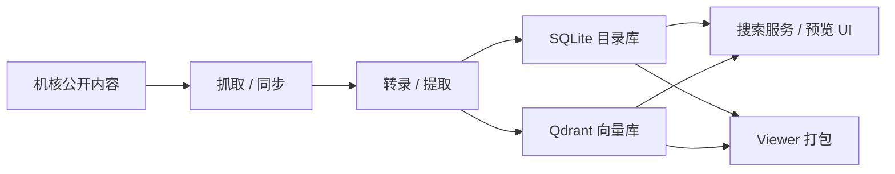

# G-Search

面向机核公开内容的本地抓取、转录、向量检索与 Viewer 打包工具链。

这个仓库是从私有工作区整理出来的公开版，保留了核心能力：抓取公开内容、准备转录与提取结果、构建 SQLite + Qdrant 搜索库、启动本地搜索服务，以及导出 query-only Viewer 包。内部运维脚本、个人工作流配件、本地数据和构建产物都已经移除。

## 这个项目能做什么

- 抓取机核公开内容，并将条目写入本地目录与目录库
- 接入多种 ASR / 转录 wrapper，为后续检索准备文本
- 把提取结果落到 SQLite，并同步构建 Qdrant 向量库
- 提供本地搜索服务与预览 UI
- 打包适合离线分发的 Windows Viewer 发布版

## 工作流概览



## 仓库结构

- `gcores_crawler/`：核心抓取、索引、搜索、Viewer 与命令行入口
- `scripts/`：精选后的通用脚本，主要用于预览库构建、ASR wrapper、搜索辅助
- `packaging/`：Windows Viewer 打包入口与 spec
- `launchers/`：少量可公开使用的 PowerShell 启动脚本

## 快速开始

1. 安装依赖。

```bash
python -m venv .venv
.venv\\Scripts\\activate
pip install -r requirements-public.txt
```

2. 准备环境变量。

复制 `.env.example`，按需设置：

- `ZHIPU_API_KEY`
- `GCORES_QDRANT_URL`
- `GCORES_QDRANT_API_KEY`
- `GCORES_QDRANT_COLLECTION`
- `GSEARCH_VIEWER_FALLBACK_API_KEY`
- `VOLCENGINE_APP_ID`
- `VOLCENGINE_ACCESS_KEY`

所有密钥都必须通过环境变量或显式命令参数传入，公开仓库里不保留硬编码 Key。

3. 抓一小批内容做验证。

```bash
python -m gcores_crawler discover articles --limit 5
python -m gcores_crawler fetch radios 212377
```

4. 构建本地搜索库。

```bash
python -m gcores_crawler build-search-index --output-dir data --qdrant-path qdrant
```

5. 启动本地搜索服务。

```bash
python -m gcores_crawler serve-search --output-dir data --qdrant-path qdrant --host 127.0.0.1 --port 8765
```

6. 导出 query-only Viewer 包。

```powershell
powershell -ExecutionPolicy Bypass -File .\launchers\build_viewer_windows_release.ps1
```

## 适合什么场景

- 想把机核公开内容做成本地可检索资料库
- 想复用一套现成的“抓取 -> 转录 -> 向量检索 -> Viewer”流水线
- 想研究 SQLite + Qdrant 混合搜索库在桌面离线分发里的做法

## 公开版刻意不包含

- `data/` 下的本地数据、转录库、搜索库与备份
- `dist/` 下的构建产物与发布包
- 虚拟环境、vendor 下载物、缓存文件
- 个人 keepalive 配置、托盘工具、本地日志、内部自动化产物
- 大部分运维、报表、对账、监控脚本

## 当前边界

- 公开版仍然偏 Windows 工作流，尤其是 Viewer 打包相关脚本
- 部分功能依赖本地准备好的 SQLite 数据和运行中的 Qdrant
- `requirements-public.txt` 是实用起点，不是严格锁版本环境
- 这里更适合作为可研究、可裁剪、可二次开发的工程基线，而不是开箱即用的 SaaS 产品

## 相关文件

- [`.env.example`](./.env.example)：环境变量示例
- [`requirements-public.txt`](./requirements-public.txt)：公开版依赖清单
- [`PUBLISH_CHECKLIST.md`](./PUBLISH_CHECKLIST.md)：再次发布或镜像前的检查项

## 说明

私有工作区有更新时，建议重新导出公开版，而不是直接在公开仓库里回填私有目录结构。这样更容易持续保证目录干净、密钥不泄露、发布边界稳定。
