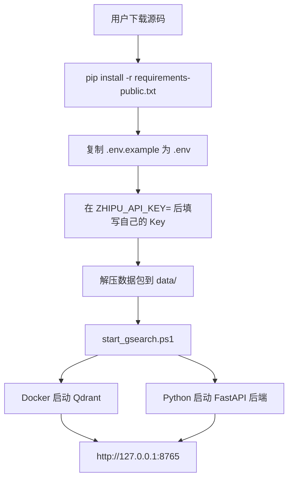
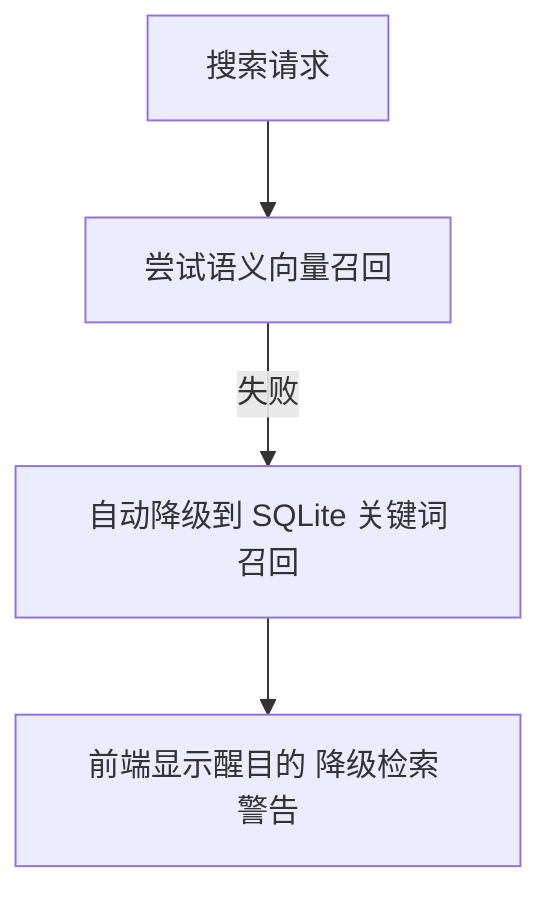

# G-Search

G-Search 是一个面向机核公开播客内容的本地搜索服务。源码公开，数据单独下载；用户把数据包解压到指定位置后，就可以启动本地 Web 搜索页。

这个公开版不做桌面打包，不内置任何 API Key，也不包含我的线上部署配置。

## 你需要准备什么

- Windows 10/11 或其他能运行 Python 的系统。
- Python 3.10+。
- Docker Desktop，推荐安装。它用于启动 Qdrant 向量库。
- 你自己的智谱 BigModel / Zhipu API Key。完整语义检索需要它。
- 单独下载的数据包：`gsearch-data-release-2026-04-29.tar.gz`。

如果你不填 Key，服务仍然可以启动，但搜索会进入关键词降级模式。页面顶部会明确提示“降级检索”，不会静默把降级结果当成完整语义检索结果。

## Key 填在哪里

复制 `.env.example` 为 `.env`，然后把 Key 填在第一段这个位置：

```dotenv
# >>> PASTE YOUR KEY AFTER THE EQUAL SIGN <<<
ZHIPU_API_KEY=
```

填完应该类似这样：

```dotenv
ZHIPU_API_KEY=your_zhipu_key_here
```

不要把 `.env` 提交到 GitHub。仓库的 `.gitignore` 已经忽略它。

## 最快启动

1. 克隆源码。

```powershell
git clone https://github.com/YOUR_NAME/YOUR_REPO.git
cd YOUR_REPO
```

2. 创建 Python 环境并安装依赖。

```powershell
python -m venv .venv
.\.venv\Scripts\activate
pip install -r requirements-public.txt
```

3. 准备 Key。

```powershell
copy .env.example .env
notepad .env
```

在 `.env` 里填写 `ZHIPU_API_KEY=`。如果暂时没有 Key，可以先留空，服务会用关键词降级检索。

4. 解压数据包到仓库根目录。

```powershell
tar -xzf path\to\gsearch-data-release-2026-04-29.tar.gz -C .
```

解压后必须看到这些路径：

```text
data/catalog.sqlite
data/reports/search_ui_meta.json
data/lexicon/alias_map.json
data/qdrant_release_storage/
```

5. 启动服务。

```powershell
.\launchers\start_gsearch.ps1
```

启动后打开：

```text
http://127.0.0.1:8765
```

`start_gsearch.ps1` 会做这些事：

- 读取 `.env`。
- 检查 `data/catalog.sqlite` 是否存在。
- 如果 Docker 可用且 `data/qdrant_release_storage/` 存在，自动启动 Qdrant。
- 启动 `python -m gcores_crawler serve-search`。
- 打开本地搜索页面。

## 数据包说明

数据不放进 GitHub。公开源码只包含程序，运行数据单独下载。

数据包文件名：

```text
gsearch-data-release-2026-04-29.tar.gz
```

数据包解压后会生成：

```text
data/
  catalog.sqlite
  reports/
    search_ui_meta.json
    search_release_audit.json
  lexicon/
    alias_map.json
    global_hotwords.txt
  qdrant_release_storage/
```

其中：

- `catalog.sqlite` 是主要 SQLite 数据库。
- `reports/search_ui_meta.json` 给前端显示当前模式、更新时间、可检索节目数、时间轴数、参与者数等信息。
- `qdrant_release_storage/` 是 Qdrant 向量库数据目录，用于完整语义召回。
- 如果 Qdrant 启动失败，后端会自动退回 SQLite 关键词检索，并在前端明确提示降级。

## 常用命令

启动本地搜索服务：

```powershell
.\launchers\start_gsearch.ps1
```

指定端口：

```powershell
.\launchers\start_gsearch.ps1 -Port 9000
```

不启动浏览器：

```powershell
.\launchers\start_gsearch.ps1 -NoBrowser
```

跳过 Qdrant，只使用关键词降级检索：

```powershell
.\launchers\start_gsearch.ps1 -SkipQdrant
```

直接用 Python 启动：

```powershell
$env:ZHIPU_API_KEY="your_zhipu_key_here"
python -m gcores_crawler serve-search --output-dir data --qdrant-url http://127.0.0.1:6336 --collection-name gcores_memory_release_v3 --host 127.0.0.1 --port 8765
```

## 服务启动链条



如果 `ZHIPU_API_KEY` 为空、余额不足，或者 embedding 服务不可达：



## 仓库里不包含什么

- 不包含 `.env` 或任何真实 API Key。
- 不包含 `data/` 数据库。
- 不包含线上域名、SSH、反向隧道、保活配置。
- 不包含我的本机日志、虚拟环境、node_modules、dist 打包产物。

## 从零构建自己的数据

如果你不想使用我提供的数据包，也可以自己抓取和构建：

```powershell
python -m gcores_crawler crawl --max-items 12
python -m gcores_crawler prepare-index --output-dir data
python -m gcores_crawler build-search-index --output-dir data --qdrant-path qdrant --embedding-provider zhipu --embedding-model embedding-3
```

这条链路会消耗你自己的 API / ASR / embedding 资源，耗时也会更长。普通用户建议直接下载数据包。

## 许可

源码使用 MIT License。数据包只用于本地检索与研究演示，请自行确认对公开内容的使用边界。
